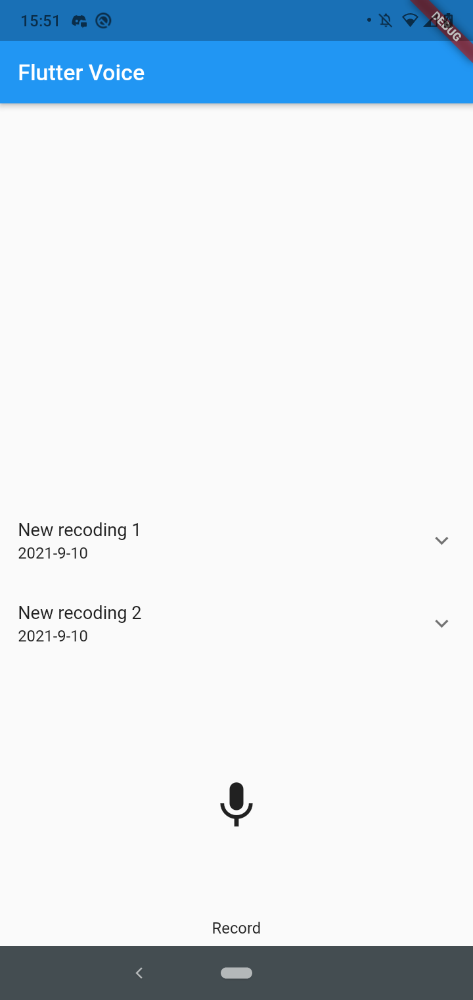
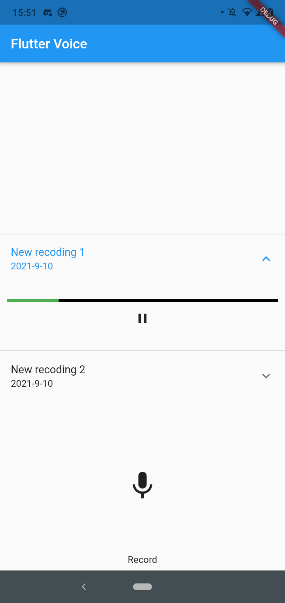

# flutterGravarSom

Por ter algumas dificuldades para adaptar o codigo orignal para rodar, estou disponibilizando minha verção em flutter pronta para usar.

IDE 
Android Studio 

flutter --version 
Flutter 2.2.1 • channel stable • https://github.com/flutter/flutter.git 
Framework • revision 02c026b03c (4 months ago) • 2021-05-27 12:24:44 -0700 
Engine • revision 0fdb562ac8 
Tools • Dart 2.13.1 

Codigo orignal 
https://github.com/gyakhoe/voice_recorder 

# dependencias
Flutter Audio Recorder (flutter_audio_recorder) 
Audio players (audio_players) 
Path Provider (path_provider) 

cupertino_icons: ^1.0.2 
flutter_audio_recorder2: ^0.0.2 
path_provider: ^2.0.3 
audioplayers: ^0.19.1 

## Imagens do app

 

Samuel Lisboa
www.mistarts.com.br

